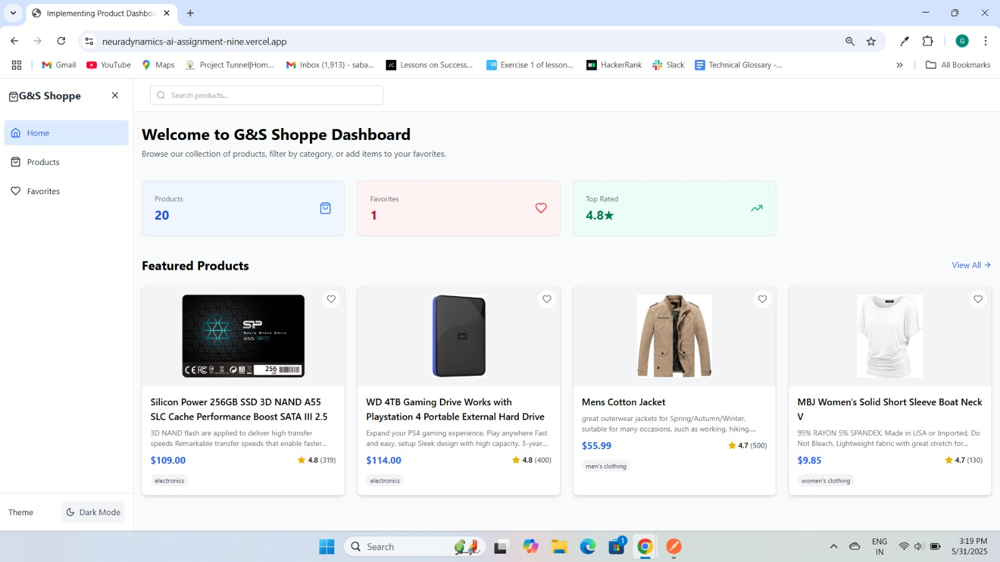
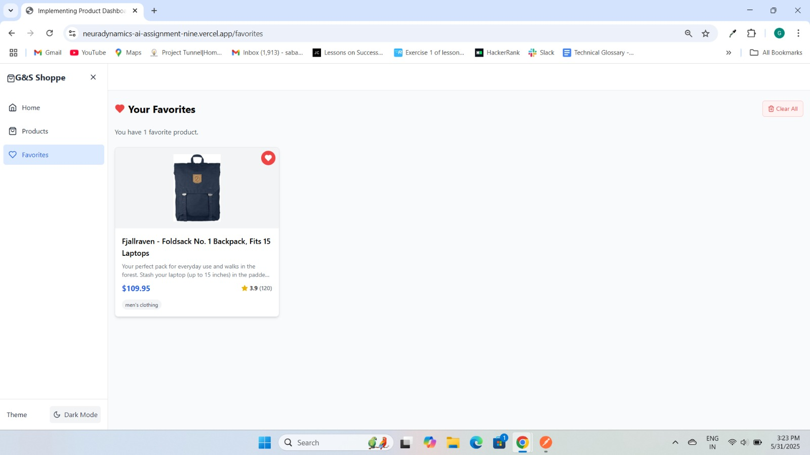
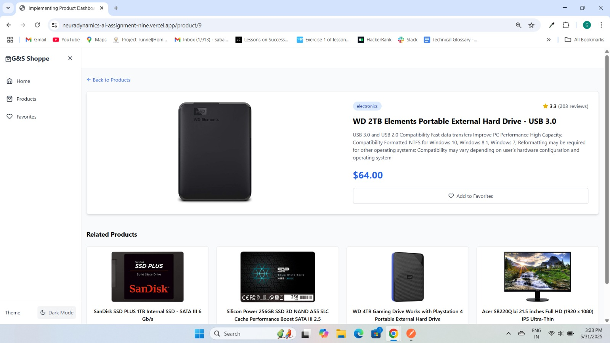

# Neuradynamics.AI-Assignment

# 🛒 E-Commerce Product Dashboard

This is a frontend assignment project for a **Frontend Developer Hiring** process. The project is built using **React**, **Redux Toolkit**, and **Tailwind CSS**, and showcases a modern and responsive e-commerce product dashboard.

---

## 🚀 Live Demo

🔗 [Click here to view the deployed site](https://neuradynamics-ai-assignment-nine.vercel.app/)

---

## 📸 Screenshot

---

## 🛠️ Tech Stack

- **React** (Functional Components & Hooks)
- **Redux Toolkit** (State Management)
- **React Router**
- **Tailwind CSS** (Styling)
- **Axios** (API calls)
- **Jest / React Testing Library** (Unit & Integration Tests)

---

## 🔍 Features

- ✅ Product Listing in a responsive grid layout  
- 🔍 Search products by title (with debounce)  
- 🧰 Filter by product category  
- ⬆️ Sort by price (Low to High / High to Low)  
- 🛒 Product Detail Page  
- ❤️ Add to / Remove from Favorites (Redux store)  
- 🧪 Unit tests for slices and components  
- 🔁 Integration tests for end-to-end flow  
- 📱 Fully responsive and accessible UI  

---

## 📦 API Used

- [Fake Store API](https://fakestoreapi.com)

---

## 🧪 Testing

- Unit tests for Redux slices and components written using **Jest**
- Integration tests to cover full user interaction flows

## ✍️ Author

**Ganesh Sabale**  
📧 [sabaleganesh99@gmail.com](mailto:sabaleganesh99@gmail.com)  
📍 Pune, Maharashtra  
💼 Frontend Developer (React.js)  
🔗 [LinkedIn](https://www.linkedin.com/in/ganeshsabale99/)

